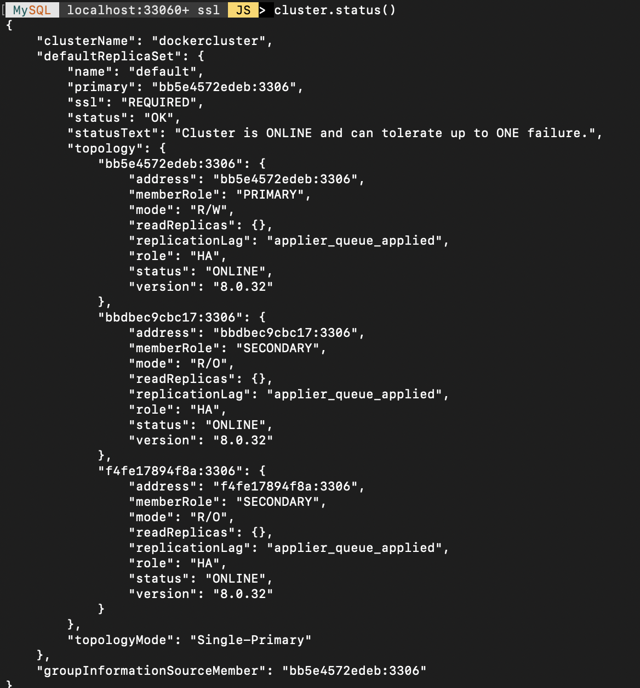

# mysql-docker-cluster

Setup a three node mysql innodb cluster using docker containers in any system.



## Steps to run

- Start the docker containers
```
docker-compose up
or
docker-compose up -d
```

- Check if three containers are running
```
docker ps
```

- In each mysql node a clusteradmin user is created with super user privileges

- To configure another user or change password modify username and password in setup.sql file

- To change root password change in compose file directly

## Configure each container

- Login to any container as clusteradmin user
```
docker exec -it {container name} /bin/bash   // exec into container

mysqlsh -uclusteradmin -p'cladmin'  // Login as clusteradmin user
```

- Check each node if it is suitable for acting as a cluster node
```
dba.checkInstanceConfiguration("clusteradmin@{container name}:port")
```
replace container name with all three containers names , this can be run from a single node as all three nodes can connect to each other

- Configure each node , this too for all three nodes
```
dba.configureInstance("clusteradmin@{container name}:port")
```

## Setting up the cluster

- Create the cluster from mysql shell
```
var cluster = dba.createCluster("{cluster name}")
```

- Check status of cluster
```
cluster.status()
```

- Add the two other nodes
```
cluster.addInstance("clusteradmin@{container name}:{port}")
```

- Check status of cluster again
```
cluster.status()
```
